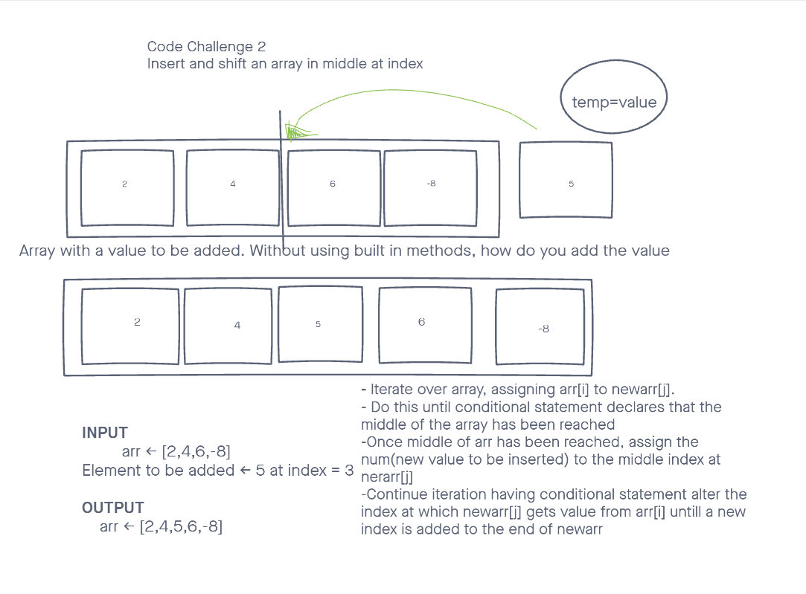

# insertShiftArray

Write a function called insertShiftArray which takes in an array and a value to be added. Without utilizing any of the built-in methods available to your language, return an array with the new value added at the middle index.

## Inputs / Outputs

Inputs: `[2,4,6,-8]`\
Output: `[2,4,5,6,-8]`

## Algorithm

If we can loop through array to find the middle of the array, then we can place the new value at middle index.
* Use a for loop to look at all the elements in the array.(iterating through the array)
* At each index, assign index of orignal array to new array at the same index.
* Once conditional logic has the loop reaching the middle index, assing the new value to middle index on new array.
  * conditional logic will have the new array no longer incrimenting the 

## Pseudocode

```plaintext
declare arr <- orignal array
declare num <- value(number to insert)
function insertShiftArray takes in `arr` and 'value':

  declare newArr <- empty arr
  declare variable(j) <- 0
  

  while index of arr <- 0, index < arr length +1, index incremented

  if arr index === array length divided 2
    new array at index <- num
    
  else newArr index === arr index
    increment var(j)
    
    
    return newArray

```

## Actual Code
```
'use strict';
const array = [2,4,6,-8];
const value = 5;

const num = value;
const arr = array;

function insertshiftarray() {

  let newArray = [];
  let j = 0;

  for (let i = 0; i < arr.length + 1; i++) {
    if (i === arr.length/2) {
      newArray[i] = num;
    }else{
      newArray[i] = arr[j];
      j++;
    }
  }
  return newArray;
}
console.log(insertshiftarray(arr,num));

```
## Visual

;

